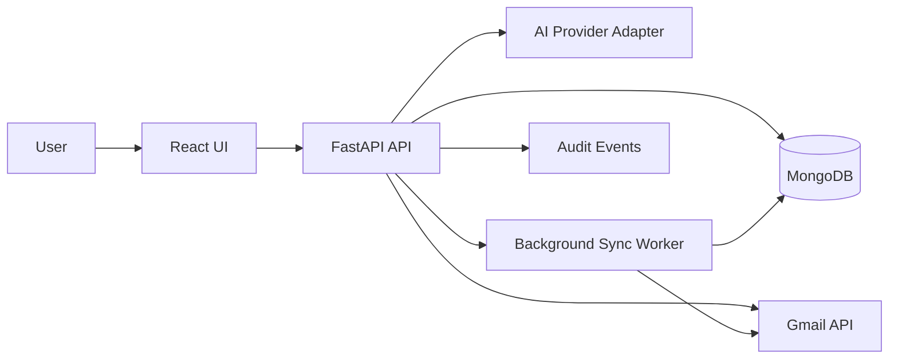

# Project 1: AI Inbox & CRM Automation Plan

## Source And Assumptions

This plan expands the Project 1 brief in [docs/plan.md](docs/plan.md). It assumes a greenfield build in this repository, because the current project only contains the planning document.

Confirmed choices:

- Scope: integration MVP, not only a mock demo.
- Frontend: React + Tailwind CSS.
- Backend: FastAPI + Pydantic.
- Data: MongoDB.
- AI: provider-flexible client so OpenAI or Claude can be swapped behind the same structured-output contract.
- First real integration: Gmail ingestion.
- Safety principle: AI drafts and suggests; the user approves before anything external is created or sent.

## Product Goal

Create a portfolio-ready AI automation app that turns messy inbound Gmail messages into structured CRM leads, suggested replies, follow-up tasks, and an auditable pipeline workflow.

The finished demo should show:

- A Gmail-connected inbox or synced demo mailbox.
- AI classification into `lead`, `support`, `partnership`, `spam`, or `urgent`.
- Entity extraction for contact, company, email, need, budget, timeline, and intent.
- Human-editable reply drafts.
- CRM stages: `new`, `qualified`, `replied`, `follow_up`, `closed`.
- Follow-up tasks with due dates.
- Audit trail showing AI suggestions, user edits, approvals, sync events, and state changes.

## High-Level Architecture

Core backend boundaries:

- `gmail`: OAuth, token refresh, message sync, normalized inbound message payloads.
- `ai`: provider adapter, structured classification/extraction/reply generation, validation.
- `crm`: leads, statuses, tasks, workflow transitions.
- `audit`: append-only events for AI/user/system activity.
- `api`: REST endpoints consumed by the React app.

## Data Model

Use MongoDB collections with Pydantic models and explicit indexes.

- `users`: demo user profile, Gmail connection status, encrypted OAuth token reference.
- `messages`: Gmail message id, thread id, sender, subject, body text, received time, sync status, raw metadata, linked lead id.
- `ai_analyses`: message id, category, confidence, extracted fields, reasoning summary, model/provider metadata, validation status.
- `leads`: name, email, company, need, budget, timeline, source message id, score, CRM status, created/updated timestamps.
- `draft_replies`: message id, lead id, generated text, edited text, tone, approval status, optional Gmail draft id.
- `tasks`: lead id, title, due date, status, owner, created from AI/user flag.
- `audit_events`: actor, action, entity type/id, before/after summary, timestamp, metadata.

Important indexes:

- `messages.gmail_message_id` unique.
- `messages.received_at` descending.
- `messages.linked_lead_id`.
- `leads.status`.
- `tasks.due_date` and `tasks.status`.
- `audit_events.entity_type`, `audit_events.entity_id`, `audit_events.timestamp`.

## Gmail Integration Plan

Start with a demo Gmail account to keep the portfolio demo safe and repeatable.

Implementation steps:

- Configure Google Cloud OAuth app for local and deployed callback URLs.
- Request the least practical scopes for the chosen behavior:
  - Read/sync messages for ingestion.
  - Add compose scope only if the MVP creates Gmail drafts after user approval.
- Add backend OAuth endpoints: start auth, callback, connection status, disconnect.
- Store refresh tokens securely using environment-provided encryption key; never commit credentials.
- Build a manual `Sync Gmail` action first, then optionally add periodic sync.
- Normalize Gmail messages into clean plain text suitable for AI processing.
- Deduplicate by Gmail message id and keep sync idempotent.
- For reply safety, default to creating/editing the draft inside the app; optionally create a Gmail draft only after approval.

## AI Workflow

Use structured JSON output and strict validation rather than free-form parsing.

AI steps per synced message:

1. Classify the message category and urgency.
2. Extract lead/contact fields.
3. Generate a short reasoning summary for auditability.
4. Create a suggested CRM lead and follow-up task if relevant.
5. Generate a reply draft in a professional default tone.
6. Validate the response against a Pydantic schema.
7. Persist the AI result, including provider, model, prompt version, and confidence.

Provider abstraction:

- Define one internal `AiClient` interface with methods such as `analyze_message()` and `draft_reply()`.
- Implement one provider first, while keeping provider-specific details behind the adapter.
- Keep prompts versioned in code so demo outputs can be explained and tested.

## Backend API Plan

Build REST endpoints around the demo flow.

Core endpoints:

- `GET /health` for deployment checks.
- `GET /gmail/status` for connection state.
- `POST /gmail/oauth/start` and `GET /gmail/oauth/callback` for Gmail auth.
- `POST /gmail/sync` to fetch recent messages.
- `GET /messages` and `GET /messages/{id}` for inbox views.
- `POST /messages/{id}/analyze` to run AI analysis.
- `GET /leads`, `GET /leads/{id}`, `PATCH /leads/{id}` for CRM data.
- `PATCH /leads/{id}/status` for pipeline movement.
- `GET /drafts/{id}`, `PATCH /drafts/{id}`, `POST /drafts/{id}/approve` for reply review.
- `GET /tasks`, `POST /tasks`, `PATCH /tasks/{id}` for follow-up work.
- `GET /audit?entity_type=&entity_id=` for activity history.

## Frontend Plan

Build a polished but focused portfolio UI.

Primary screens:

- Landing/demo setup screen explaining the workflow and Gmail connection state.
- Inbox screen with synced messages, category badges, urgency indicators, and analysis status.
- Message detail screen showing original email, extracted fields, AI reasoning summary, suggested reply, and approval actions.
- CRM pipeline board with draggable or button-based status transitions.
- Lead detail drawer/page with contact fields, linked message, draft reply, tasks, and audit log.
- Task list for follow-ups.
- Settings screen for Gmail connection/disconnect and demo data reset.

UI principles:

- Make human approval visually central.
- Show confidence and reasoning without overwhelming the user.
- Include empty, loading, sync error, OAuth error, and AI validation error states.
- Keep demo data available even if Gmail is not connected, so reviewers can still explore the app.

## Implementation Phases

1. Project foundation

- Create frontend and backend app structure.
- Add environment config, `.env.example`, local Docker Compose for MongoDB, and baseline README.
- Add lint/test tooling appropriate to each app.

2. Backend domain model

- Implement Pydantic models and MongoDB repositories.
- Add API routes for messages, leads, drafts, tasks, and audit events.
- Seed sample messages for a no-auth demo mode.

3. Gmail integration

- Add Google OAuth flow.
- Implement manual sync from the demo Gmail account.
- Normalize messages and store them idempotently.
- Add connection status and disconnect behavior.

4. AI analysis pipeline

- Implement provider-flexible AI client.
- Add structured schemas for classification, extraction, task suggestion, and reply drafting.
- Add validation, error handling, prompt versioning, and persistence.

5. Human approval workflow

- Connect AI suggestions to leads, tasks, and draft replies.
- Require user confirmation before lead/status changes that affect the CRM workflow.
- Add approval/edit history to audit events.

6. Frontend workflow

- Build the inbox, message review, CRM board, lead detail, task list, and settings screens.
- Wire API calls and error states.
- Add a clear guided demo path.

7. Testing and evaluation

- Add backend tests for AI schema validation, Gmail normalization, deduplication, CRM status transitions, and audit event creation.
- Add a small evaluation set of sample messages with expected categories and extracted fields.
- Add frontend smoke tests for the main review/approval flow if the chosen tooling supports it quickly.

8. Deployment and portfolio packaging

- Deploy backend, frontend, and MongoDB using a practical free/low-cost setup.
- Configure deployed OAuth callback URL.
- Add README architecture diagram, setup instructions, demo credentials guidance, screenshots/GIFs, and trade-off notes.
- Write the portfolio case study focused on admin-time reduction, human approval, Gmail integration, and auditability.

## MVP Acceptance Criteria

The project is MVP-complete when:

- A reviewer can run the app locally from the README.
- A reviewer can explore seeded demo messages without Gmail credentials.
- The app can connect to a demo Gmail account and sync recent inbound messages.
- At least five realistic messages are classified and extracted into structured CRM data.
- The user can review/edit/approve a reply draft.
- Leads can move through the CRM pipeline.
- Follow-up tasks can be created and completed.
- Audit events record AI analysis, user edits, approvals, and CRM status changes.
- Tests cover the highest-risk backend behavior.
- The deployed demo and case study are ready to link from the portfolio.

## Stretch Features After MVP

- Gmail draft creation after approval.
- Reply tone selector.
- Lead scoring.
- SLA timer for urgent messages.
- Background scheduled Gmail sync.
- HubSpot or Airtable CRM sync as a second integration.
- More formal AI evaluation dashboard for classification accuracy.

## Main Risks And Mitigations

- Gmail OAuth complexity: use a demo Gmail account, manual sync first, and keep scopes narrow.
- AI output inconsistency: require structured output, Pydantic validation, prompt versioning, and fallback error states.
- Demo fragility: ship seeded demo data so the app remains reviewable without external services.
- Overbuilding CRM features: keep CRM workflow limited to lead status, tasks, draft replies, and audit trail.
- Secret handling: use `.env.example`, environment variables, token encryption, and no committed credentials.
