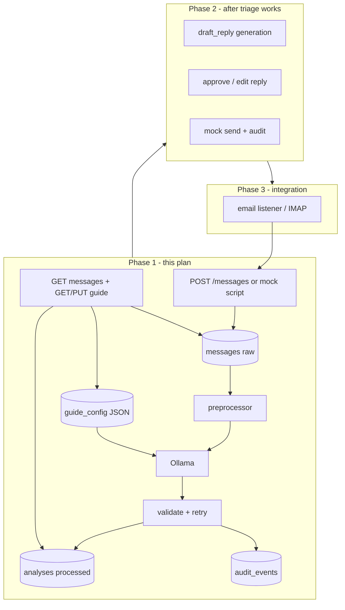
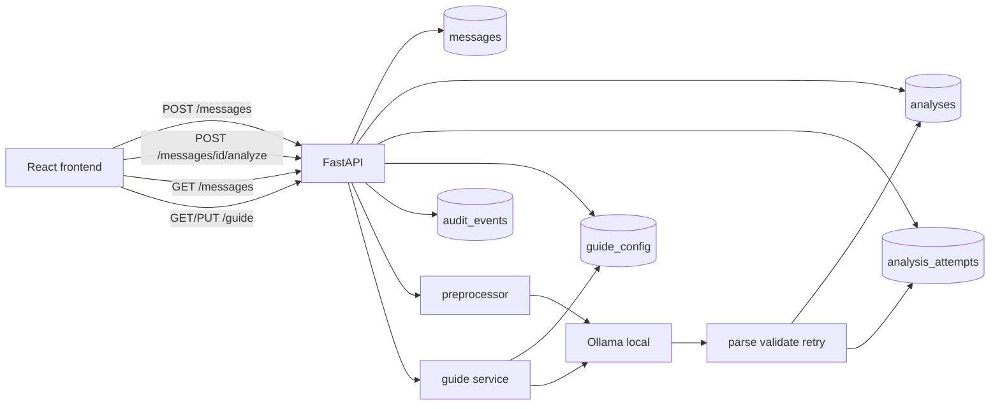

# Ollama Dev Backend: Triage + Extraction + SQLite

## Alignment with [docs/how this project will work](docs/how%20this%20project%20will%20work)


| Your vision                                                 | Plan response                                                                                                                                                          |
| ----------------------------------------------------------- | ---------------------------------------------------------------------------------------------------------------------------------------------------------------------- |
| Listener picks up emails to a group address                 | **Deferred (Phase 3).** MVP uses `POST /messages` + optional mock ingest script. Same pipeline; swap transport later.                                                  |
| Raw emails stored with ID linked to processed result        | `**messages` = immutable raw.** `**analyses` = processed output**, FK `message_id`. Re-analyze creates a **new analysis row** (version history), never overwrites raw. |
| Email parsed into readable data                             | `**preprocessor.py`** — normalize + `extract_signals` before Ollama.                                                                                                   |
| JSON-configurable guide for the AI agent                    | `**guide_config` table** (JSON document) + seed from `[backend/data/guide_config.json](backend/data/guide_config.json)`. Not markdown-only — UI needs structured JSON. |
| Only accept processable AI data; log bad response and retry | `**analysis_attempts` table** + retry loop (max 3) in `analyze_email`. After max retries → `needs_review=true`, no silent bad data.                                    |
| AI response stored in database                              | `**analyses` row** per successful run.                                                                                                                                 |
| Frontend reads DB, categorized list, detail, original email | `**GET /messages`**, `**GET /messages/{id}**` returns raw + latest analysis.                                                                                           |
| User accept/edit AI response and send to customer           | **Phase 2** — add `draft_reply` + approval endpoints; not in first implementation slice.                                                                               |
| User view/edit guide and save                               | `**GET /guide`**, `**PUT /guide**` persist to `guide_config` + `audit_events`.                                                                                         |
| Audit trail                                                 | `**audit_events` table** from Phase 1 (ingest, analyze, guide save, later approve/send).                                                                               |


## Where we disagree (on purpose)

1. **Email listener in week one** — A real listener (IMAP/webhook) adds OAuth, polling, duplicates, and failure modes before triage works. Your architecture is right long-term; **mock ingest first** proves the AI + DB loop. The listener should call the same `ingest_message()` function nothing else uses.
2. **Unlimited AI retries** — Retrying on bad JSON is correct, but **cap at 2–3 attempts** on Ollama. Local models can loop on the same mistake and burn minutes per email. After the cap: store failed attempts in `analysis_attempts`, set `needs_review`, let a human fix or re-run from the UI.
3. **Guide as markdown only** — Markdown is fine for docs; **editable guide in the UI needs JSON** (categories, extraction field definitions, prompt fragments). Keep `[classification_guide.md](backend/data/classification_guide.md)` as human-readable reference; **runtime source of truth = `guide_config` in SQLite**.
4. **One Ollama call vs “review and respond”** — Your doc says the agent should “review the email and respond.” That implies **triage + draft reply**. For dev efficiency, **Phase 1 = triage + extraction only** (one JSON call). **Phase 2 = second call or extended schema** for `draft_reply`. Cramming both into v1 makes local models slower and harder to test.
5. **“Send to customer” in MVP** — Portfolio value is **human approves before send**. Phase 2 should use **mock send** (log + audit event) unless you already have SMTP credentials. Real SMTP is a stretch feature.


My answers to each disagreement:  
1. We can add something simpler for the start for AI to digest

1. we will cap the retries (max 2 as start)
2. Guide will be editible by the user in a textbox, now how we will store it in backend - we will use best practice
3. We will not add this feature now, but we need to keep this in mind and be ready for extension
4. same as 4

## Phased roadmap (full product vs this plan)




## Goal

In **dev**, the backend uses **Ollama** (local models) to read an inbound email and return one **validated JSON** payload containing:

1. **Where it belongs** — `category`, `priority`, `suggested_action`, `reason` (existing triage contract in `[backend/models/classifier_models.py](backend/models/classifier_models.py)`)
2. **Useful extracted fields** — order IDs, instance names, failure rows, sender hints, etc. (flexible but typed)

Results are **saved in SQLite** (not loose JSON files). The frontend later calls `GET` endpoints to list/fetch messages and their stored analysis.




## Design decisions


| Decision           | Choice                                                                  | Why                                                                                                        |
| ------------------ | ----------------------------------------------------------------------- | ---------------------------------------------------------------------------------------------------------- |
| LLM in dev         | Ollama HTTP API (`/api/chat`)                                           | No API keys, runs offline, matches your dev setup                                                          |
| Calls per email    | **One** Ollama call                                                     | Local models are slower; one JSON response with triage + extraction is more efficient than two round-trips |
| Persistence        | **SQLite** + JSON column for `extracted_fields`                         | Fast indexed lookups for frontend; portfolio-credible; swap to Postgres later without changing API shape   |
| Provider isolation | Keep `[backend/services/llm_client.py](backend/services/llm_client.py)` | Add `ollama` branch; cloud providers stay optional for prod later                                          |
| “Folder” mapping   | `destination` derived from `(category, priority)`                       | UI can show a human label without asking the model to invent folder names                                  |


**Destination mapping (MVP, configurable later):**


| category          | priority          | destination (stored + returned) |
| ----------------- | ----------------- | ------------------------------- |
| human             | urgent_action     | urgent_human                    |
| human             | non_urgent_action | human_queue                     |
| human             | ignore            | human_queue                     |
| machine_generated | urgent_action     | alerts_urgent                   |
| machine_generated | ignore            | alerts_archive                  |
| machine_generated | non_urgent_action | alerts_review                   |
| event             | *                 | events                          |
| spam              | *                 | spam                            |


## Data model extensions

### 1. Extend the LLM output contract

Add to `[backend/models/classifier_models.py](backend/models/classifier_models.py)`:

```python
class ExtractedFields(BaseModel):
    order_ids: list[str] = []
    instance_names: list[str] = []
    error_summary: str | None = None
    sender_name: str | None = None
    detected_keywords: list[str] = []  # e.g. FAIL, Timeout, MOC

class EmailAnalysis(BaseModel):
    category: Category
    priority: Priority
    suggested_action: SuggestedAction
    reason: str
    destination: str          # derived after validation (not from model)
    extracted_fields: ExtractedFields
```

- `ClassificationResult` stays for **eval tests** against `[backend/data/phase_1_email_triage_examples.json](backend/data/phase_1_email_triage_examples.json)` (no extraction in labels yet).
- `EmailAnalysis` is the **live** Ollama contract + API response shape.

### 2. SQLite tables (new module)

New `[backend/db/schema.sql](backend/db/schema.sql)` and `[backend/db/repository.py](backend/db/repository.py)`:

`**messages`** (raw — immutable after ingest)

- `id` (UUID text, PK)
- `subject`, `body`, `sender`, `received_at`, `source` (e.g. `mock`, `api`, later `imap`)
- `created_at`
- Never updated by AI; audit trail references this ID.

`**analyses**` (processed — one row per successful analyze run)

- `id` (PK)
- `message_id` (FK → messages)
- `category`, `priority`, `suggested_action`, `reason`, `destination`
- `extracted_fields` (JSON text)
- `model_name`, `needs_review`, `attempt_count`
- `created_at`
- Latest analysis for a message = `ORDER BY created_at DESC LIMIT 1`.

`**analysis_attempts**` (failed or retry attempts — your “log bad response” requirement)

- `id`, `message_id`, `attempt_number`
- `raw_llm_response` (text)
- `error_type` (e.g. `json_parse`, `validation`, `ollama_timeout`)
- `error_detail` (text)
- `created_at`

`**guide_config**` (JSON guide editable from frontend)

- `id` (singleton row or versioned: `version`, `is_active`)
- `config` (JSON text) — categories, priorities, extraction field defs, policy text blocks
- `updated_at`, `updated_by` (optional, for audit)

`**audit_events**`

- `id`, `entity_type` (`message` | `analysis` | `guide`), `entity_id`
- `action` (e.g. `ingested`, `analyzed`, `analyze_failed`, `guide_updated`)
- `actor` (`system` | `user`)
- `payload` (JSON summary)
- `created_at`

Seed file `[backend/data/guide_config.json](backend/data/guide_config.json)` mirrors `label_schema` + extraction rules; loaded into `guide_config` on first startup.

Repository functions:

- `create_message(email, source) -> message_id` + audit `ingested`
- `save_analysis(...)`, `save_analysis_attempt(...)`
- `get_message_with_latest_analysis(message_id)`
- `list_messages(limit, offset)` — include destination, priority, needs_review for inbox UI
- `get_guide_config()`, `update_guide_config(config)` + audit `guide_updated`

Use stdlib `**sqlite3**` for MVP (sync is fine for local dev).

### 3. Config for Ollama

Update `[backend/config.py](backend/config.py)`:

```python
llm_provider: str = "ollama"          # ollama | openai | anthropic
ollama_base_url: str = "http://127.0.0.1:11434"
ollama_model: str = "llama3.2"        # user pulls via: ollama pull llama3.2
database_url: str = "sqlite:///./data/inbox.db"
```

Add `[backend/.env.example](backend/.env.example)` documenting these vars (no secrets for Ollama).

## Ollama integration

Implement in `[backend/services/llm_client.py](backend/services/llm_client.py)`:

- `call_llm(system_prompt, user_prompt) -> str` uses `httpx` POST to `{ollama_base_url}/api/chat`
- Payload includes `model`, `messages`, and `**"format": "json"**` (Ollama JSON mode — strongly improves structured output)
- Timeout (e.g. 120s) because local inference can be slow on first token
- On connection error: raise a clear `OllamaUnavailableError` so the router can return `503` with a helpful message (“Is Ollama running? `ollama serve`”)

**Recommended dev models** (document in README, user picks one):

- `llama3.2` — good balance of speed/quality for JSON
- `mistral` — alternative if JSON quality is weak

No `openai` package required for dev path; keep it in `requirements.txt` as optional for later prod.

## Prompt and guide updates

1. **Create** `[backend/data/guide_config.json](backend/data/guide_config.json)` — structured config (labels, extraction fields, policy blocks). Seed DB on startup.
2. **Keep** `[backend/data/classification_guide.md](backend/data/classification_guide.md)` as developer documentation (optional sync from JSON, not runtime source in MVP).
3. **Implement** `[backend/services/guide.py](backend/services/guide.py)`:
  - `load_guide_config()` from DB (fallback to seed file)
  - `build_system_prompt()` — triage policy, allowed enums, extraction instructions, strict JSON schema for `EmailAnalysis` (`destination` computed in Python, not from model)
4. **Implement** `[backend/services/preprocessor.py](backend/services/preprocessor.py)`: `normalize_email`, `extract_signals` (order IDs, FAIL/Timeout, instances) — hints appended to user prompt.

## Classifier pipeline (orchestrator)

Update `[backend/services/classifier.py](backend/services/classifier.py)`:


| Function                                            | Purpose                                              |
| --------------------------------------------------- | ---------------------------------------------------- |
| `parse_llm_response(raw)`                           | Strip fences, `json.loads`, handle malformed output  |
| `validate_analysis(data)`                           | Pydantic → `EmailAnalysis` (without destination yet) |
| `compute_destination(category, priority)`           | Deterministic folder routing                         |
| `analyze_email(email, message_id) -> EmailAnalysis` | Full pipeline with retry + persistence hooks         |
| `classify_email(email)`                             | Eval tests only (classification subset, no DB)       |


Flow (matches your “only accept processable data, retry on failure”):

```
email → build_user_prompt → build_system_prompt
     → loop attempt 1..MAX_RETRIES (default 3):
           call_llm (Ollama) → parse_llm_response
           → on failure: save_analysis_attempt(message_id, raw, error); continue
           → on success: validate_analysis → compute_destination
           → save_analysis → audit analyzed → return
     → all retries failed: needs_review=true, audit analyze_failed, raise or return error state
```

**Retry prompt tweak (optional):** on attempt 2+, append “Previous response was invalid: {error}. Return ONLY valid JSON matching the schema.”

## API endpoints (frontend contract)

Extend beyond `[backend/routers/classify.py](backend/routers/classify.py)` with a **messages router** `[backend/routers/messages.py](backend/routers/messages.py)`:


| Method | Path                     | Purpose                                                                    |
| ------ | ------------------------ | -------------------------------------------------------------------------- |
| `POST` | `/messages`              | Ingest email (`EmailInput`), save to DB, return `{ id, ... }`              |
| `POST` | `/messages/{id}/analyze` | Run Ollama pipeline, save analysis, return full record                     |
| `GET`  | `/messages/{id}`         | Fetch message + latest analysis (frontend detail view)                     |
| `GET`  | `/messages`              | List inbox (id, subject, destination, priority, needs_review, created_at)  |
| `GET`  | `/guide`                 | Return current `guide_config` JSON for frontend display/edit               |
| `PUT`  | `/guide`                 | Save updated guide (validate structure), audit `guide_updated`             |
| `GET`  | `/messages/{id}/audit`   | Audit trail for one message (analyze attempts, guide changes affecting it) |
| `POST` | `/classify`              | **Optional** stateless triage (no DB) for quick testing                    |


Wire in `[backend/main.py](backend/main.py)`: `messages_router`, `guide_router`, startup hook to init DB + seed `guide_config`.

**Phase 2 endpoints (document now, implement later):**

- `POST /messages/{id}/draft-reply` — second Ollama call or extended schema
- `PATCH /messages/{id}/reply` — user edits draft
- `POST /messages/{id}/send` — mock send + audit (no real SMTP in MVP)

**Response shape for GET** (example):

```json
{
  "id": "uuid",
  "email": { "subject": "...", "body": "...", "sender": null },
  "analysis": {
    "category": "human",
    "priority": "urgent_action",
    "suggested_action": "acknowledge",
    "reason": "...",
    "destination": "urgent_human",
    "extracted_fields": {
      "order_ids": ["PUKOID3234234234"],
      "instance_names": [],
      "error_summary": null
    },
    "needs_review": false,
    "model": "llama3.2"
  }
}
```

## Dependencies

Update `[backend/requirements.txt](backend/requirements.txt)`:

- Add: `httpx` (already listed), ensure used for Ollama
- Add: none required for SQLite (stdlib `sqlite3`) OR `aiosqlite` if async preferred later
- Ollama itself is **installed separately** (not pip): document `ollama pull` + `ollama serve`

## Testing strategy

`[backend/tests/test_classifier.py](backend/tests/test_classifier.py)`:

1. **Unit tests (no Ollama):** `parse_llm_response`, `validate_analysis`, `compute_destination`, invalid enum rejection
2. **Integration test (optional, marked `@pytest.mark.ollama`):** one example from JSON file, skipped in CI unless `OLLAMA_MODEL` set
3. **Repository test:** save + get round-trip with temp SQLite file

Eval set in `phase_1_email_triage_examples.json` still tests **classification fields only**; extraction can be asserted loosely (e.g. order ID present for `phase1_001`) once Ollama path works.

## Implementation order

1. **Config + `.env.example`** — Ollama defaults, `MAX_LLM_RETRIES=3`
2. **DB schema + repository** — messages, analyses, analysis_attempts, guide_config, audit_events; seed guide JSON
3. **Guide + preprocessor** — load guide from DB; build prompts
4. **Ollama `llm_client`** — verify with `/classify` or script
5. **Classifier `analyze_email`** — parse, validate, retry loop, destination mapping, attempt logging
6. **Messages + guide routers** — wire `main.py`, audit on key actions
7. **Tests** — retry behavior, invalid JSON logged, repo round-trip, guide PUT
8. **README** — dev setup; document Phase 2/3 explicitly so vision doc and code stay aligned

## Dev setup (document in README)

```bash
# Terminal 1
ollama pull llama3.2
ollama serve

# Terminal 2 (backend/)
pip install -r requirements.txt
cp .env.example .env
uvicorn main:app --reload
```

Example flow:

```bash
# Create message
curl -X POST http://127.0.0.1:8000/messages -H "Content-Type: application/json" -d '{"email":{"subject":"...","body":"..."}}'

# Analyze (calls Ollama, stores result)
curl -X POST http://127.0.0.1:8000/messages/{id}/analyze

# Frontend fetch
curl http://127.0.0.1:8000/messages/{id}
```

## Interview talking points

- **Dev vs prod LLM:** Ollama locally for zero-cost iteration; `llm_client` abstraction allows cloud swap without changing routes.
- **One structured call:** triage + extraction in one JSON response, validated before persistence.
- **SQLite as system of record:** frontend reads stable IDs; extracted fields stored as JSON column for flexible schema evolution.
- **Safety:** invalid model output never overwrites stored analysis without `needs_review`; destination is computed in code, not trusted from the model.

## Out of scope (Phase 1 only)

- React frontend implementation (API contract ready)
- Email listener / IMAP / group mailbox (Phase 3) — use `POST /messages` or mock ingest script
- Draft reply generation, edit, send to customer (Phase 2)
- CRM pipeline board, tasks (portfolio plan Phase B)
- Real SMTP send
- Postgres migration (easy follow-up later)

## Reference

- Vision: `[docs/how this project will work](docs/how%20this%20project%20will%20work)`
- Triage examples: `[backend/data/phase_1_email_triage_examples.json](backend/data/phase_1_email_triage_examples.json)`
- Portfolio full scope: `[docs/plan.md](docs/plan.md)` Project 1

