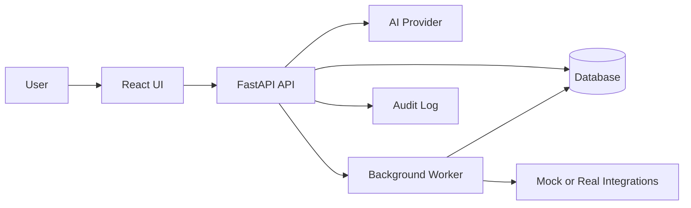

# Portfolio AI Automation Project Plans

These four projects should work together as a hiring narrative: **AI systems that automate repetitive business work, keep humans in control, and expose production-style engineering judgment**. Each project should have a live demo, GitHub repo, case-study write-up, screenshots/GIFs, and a short business outcome statement.

## Project 1: AI Inbox & CRM Automation

**Goal:** Automate inbound lead/admin handling: classify messages, extract customer details, draft replies, create CRM records, and generate follow-up tasks.

**Why this belongs in the portfolio:** This is the clearest “AI automation services” demo. It is easy for recruiters, small businesses, and hiring managers to understand because it maps directly to wasted admin time.

**Target users:** Small sales teams, consultants, recruiters, agencies, founders.

**MVP scope:**

- Inbound message form or mock inbox.
- AI classification: lead, support, partnership, spam, urgent.
- Entity extraction: name, company, email, need, budget/timeline if present.
- AI-drafted reply with editable human approval.
- CRM pipeline board: new, qualified, replied, follow-up, closed.
- Follow-up task creation with due date.
- Activity log showing what AI suggested and what the user approved.

**Recommended stack:**

- Frontend: React, Tailwind CSS.
- Backend: FastAPI, Pydantic.
- Data: PostgreSQL or MongoDB.
- AI: OpenAI or Claude API.
- Background work: simple FastAPI background tasks first; Celery/RQ later only if needed.
- Integrations: start with mock CRM; optional Airtable/HubSpot later.

**Data model:**

- `Message`: raw content, sender, source, received time.
- `Lead`: contact fields, company, status, score.
- `AiAnalysis`: category, extracted fields, confidence, reasoning summary.
- `DraftReply`: generated text, edited text, approval status.
- `Task`: title, owner, due date, linked lead.
- `AuditEvent`: action, timestamp, actor, AI/user source.

**Demo flow:**

1. User submits or selects a messy inbound enquiry.
2. System classifies it and extracts CRM fields.
3. Dashboard shows suggested reply and follow-up task.
4. User edits/approves the reply.
5. Lead moves through the CRM pipeline.

**Portfolio case-study angle:**

- Problem: repetitive inbox triage and CRM data entry.
- Trade-off: AI suggests actions, but humans approve external communication.
- Outcome: reduces manual admin while preserving review and auditability.

**Stretch features:**

- Gmail/Outlook mock integration.
- HubSpot or Airtable sync.
- Lead scoring.
- Reply tone selector.
- SLA timer for urgent messages.
- Evaluation set with sample messages and expected classifications.

## Project 2: Customer Support Triage System

**Goal:** Help support teams classify tickets, detect urgency/sentiment, route work, and draft internal/customer-facing responses.

**Why this belongs in the portfolio:** It shows a more operational version of AI automation than the CRM project. It also proves you understand queues, prioritisation, escalation, and human-in-the-loop workflows.

**Target users:** SaaS support teams, ecommerce teams, internal IT helpdesks.

**MVP scope:**

- Ticket inbox with sample incoming tickets.
- AI categorisation: billing, bug, account access, feature request, complaint, general question.
- Priority scoring: low, normal, high, urgent.
- Sentiment/escalation detection.
- Suggested team routing.
- Draft response suggestions.
- Agent dashboard with filters and status workflow.
- Analytics: ticket volume by category, unresolved urgent tickets, average time in status.

**Recommended stack:**

- Frontend: React, Tailwind CSS.
- Backend: FastAPI.
- Data: PostgreSQL or MongoDB.
- AI: OpenAI/Claude with structured JSON output.
- Optional realtime: WebSockets for new-ticket updates, useful because it matches your current stack.

**Data model:**

- `Ticket`: subject, body, requester, channel, status, priority.
- `TriageResult`: category, priority, sentiment, escalation risk, suggested team.
- `ResponseDraft`: generated response, approval status, final response.
- `AgentNote`: internal notes.
- `TicketEvent`: status changes and assignment history.

**Demo flow:**

1. Several tickets arrive in the inbox.
2. AI triage labels each ticket and flags urgent/risky ones.
3. User reviews the suggested route and response.
4. Ticket is assigned and moved through open, waiting, resolved.
5. Analytics page shows operational insight.

**Portfolio case-study angle:**

- Problem: support teams waste time manually reading, tagging, and routing tickets.
- Trade-off: AI handles classification and drafts, but agents retain control over final responses.
- Outcome: faster triage, less missed urgency, clearer support operations.

**Stretch features:**

- Knowledge-base lookup for response grounding.
- SLA breach alerts.
- Duplicate ticket detection.
- Redaction for sensitive data.
- Test harness measuring classification accuracy on sample tickets.

## Project 3: AI Knowledge Base Assistant For Internal Teams

**Goal:** Let teams upload internal docs and ask questions with cited answers, missing-document detection, and admin controls.

**Why this belongs in the portfolio:** This proves RAG-style AI knowledge work without being a generic chatbot. The important part is citations, document management, and knowing when the assistant does not have enough evidence.

**Target users:** Internal operations teams, engineering teams, HR, compliance, IT support.

**MVP scope:**

- Document upload for markdown, text, or PDF.
- Chunking/indexing pipeline.
- Search and chat interface.
- Answers with source citations.
- “I don’t know” behaviour when sources are weak.
- Admin dashboard for documents: uploaded, indexed, stale, failed.
- Feedback buttons: helpful, incorrect, missing info.
- List of unanswered questions to reveal documentation gaps.

**Recommended stack:**

- Frontend: React, Tailwind CSS.
- Backend: FastAPI.
- Data: PostgreSQL plus vector extension, or a lightweight vector DB.
- AI: embedding model plus OpenAI/Claude for answer generation.
- Parsing: start with text/markdown; add PDF extraction after MVP.

**Data model:**

- `Document`: title, source, owner, status, uploaded time.
- `Chunk`: document id, text, embedding id/vector, metadata.
- `Question`: query, user, timestamp.
- `Answer`: response, cited chunks, confidence/grounding score.
- `Feedback`: rating, comment, linked answer.
- `DocGap`: unanswered or low-confidence question.

**Demo flow:**

1. User uploads internal policy/runbook/FAQ docs.
2. System indexes the documents.
3. User asks a question.
4. Assistant answers with citations and highlights source sections.
5. User asks something missing; system refuses or marks a documentation gap.

**Portfolio case-study angle:**

- Problem: teams lose time searching scattered internal documentation.
- Trade-off: prioritise grounded answers and citations over flashy chat behaviour.
- Outcome: faster self-service support and visible documentation gaps.

**Stretch features:**

- Role-based access control.
- Document freshness warnings.
- Slack/Teams-style Q&A simulation.
- Citation highlighting in the UI.
- Evaluation set for answer quality and retrieval accuracy.

## Project 4: Internal Ops Automation Platform

**Goal:** Build a small reliability-focused platform for running repeatable operational workflows: checks, runbooks, approvals, logs, and alerts.

**Why this belongs in the portfolio:** This connects directly to your Bank of America production support/SRE background. It differentiates you from people building only AI demos because it shows reliability, audit trails, failure states, and operational thinking.

**Target users:** SRE teams, internal platform teams, support engineers, operations teams.

**MVP scope:**

- Automation catalogue with reusable runbook templates.
- Manual trigger for jobs.
- Scheduled trigger for simple checks.
- Job status: queued, running, succeeded, failed, needs approval.
- Execution logs and result payloads.
- Approval gate for risky actions.
- Webhook trigger endpoint.
- Notification simulation for failures.
- Dashboard for recent runs, failures, and pending approvals.

**Recommended stack:**

- Frontend: React, Tailwind CSS.
- Backend: FastAPI.
- Data: PostgreSQL or MongoDB.
- Execution: Python worker process or FastAPI background tasks for MVP.
- Realtime: WebSockets for live job status.
- Optional AI: AI-generated runbook summary or failure explanation, but keep core automation non-AI first.

**Data model:**

- `Automation`: name, description, risk level, trigger type, parameters schema.
- `Run`: automation id, status, started time, finished time, triggered by.
- `RunLog`: run id, timestamp, level, message.
- `Approval`: run id, requester, approver, status, decision reason.
- `WebhookEvent`: source, payload, linked run.
- `Notification`: type, status, destination, payload.

**Demo flow:**

1. User selects a runbook such as “API health check” or “stale ticket reminder”.
2. User enters parameters and triggers it.
3. Run appears in live dashboard with logs.
4. A risky run pauses for approval.
5. Failed run generates a concise summary and simulated alert.

**Portfolio case-study angle:**

- Problem: support/SRE teams repeat the same checks and manual actions during incidents.
- Trade-off: build guardrails, approvals, logs, and repeatability before adding advanced automation.
- Outcome: fewer manual steps, better traceability, and safer operational workflows.

**Stretch features:**

- Cron scheduling.
- Retry policies.
- Secrets handling with environment variables.
- YAML/JSON runbook definitions.
- AI incident summary from logs.
- Integration with the Knowledge Base Assistant for runbook lookup.

## Suggested Build Order

1. **AI Inbox & CRM Automation**: best first project because it is easiest to explain and strongest for AI automation positioning.
2. **Customer Support Triage System**: reuses patterns from the inbox project while proving a different business workflow.
3. **AI Knowledge Base Assistant**: adds RAG, citations, embeddings, and more serious AI architecture.
4. **Internal Ops Automation Platform**: closes the portfolio with reliability and SRE credibility.

## Shared Engineering Standards Across All Projects

Each project should include:

- Clear README with problem, users, demo flow, architecture, setup, and trade-offs.
- Seed/demo data so reviewers can try it quickly.
- `.env.example` without secrets.
- Basic tests around the riskiest logic: AI response parsing, classification, workflow transitions, retrieval, or job execution.
- Error states in the UI.
- Human approval where AI affects external communication or important workflow state.
- Small architecture diagram in the README.
- Live deployment where possible.

## Shared Portfolio Presentation Format

For each project entry in [src/data/projects.js](src/data/projects.js), use the same structure:

- One-line business problem.
- Your role: product scope, backend, frontend, AI workflow, deployment.
- Stack chips.
- Three outcome-focused highlights.
- Links to live demo and source.
- Case-study body covering problem, constraints, solution, trade-offs, and next iteration.

## Architecture Pattern

The exact features should differ per project, but the underlying pattern should feel consistent: React UI, FastAPI service layer, structured data models, AI where it creates business value, background processing for automation, and auditability for trust.