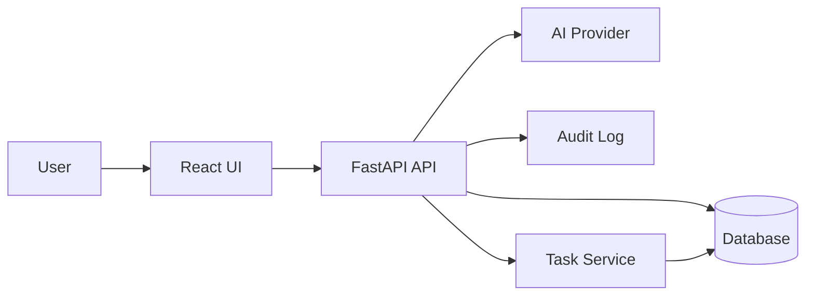

# Project 1: AI Inbox & CRM Automation Build Plan

## Outcome
Build a portfolio-ready AI inbox and CRM automation app that shows you can turn messy inbound messages into structured sales workflow: classification, extracted lead data, draft replies, CRM movement, follow-up tasks, and an audit trail.

The key interview story is: **AI should reduce admin work, but humans stay in control of external communication and important CRM state changes.**

## Source Scope
Use [`docs/plan.md`](docs/plan.md) as the product brief. Project 1 MVP includes:

- Inbound message form or mock inbox.
- AI classification: lead, support, partnership, spam, urgent.
- Entity extraction: name, company, email, need, budget, timeline.
- Editable AI-drafted reply with human approval.
- CRM board: new, qualified, replied, follow-up, closed.
- Follow-up task creation.
- Activity log showing AI suggestions and user-approved actions.

## Phase 1: Understand The Product Problem
Before coding, define the business workflow clearly.

- Write 5-8 realistic messy inbound messages: sales lead, urgent enquiry, vague consultant request, spam, support-style message.
- Define what the system should produce from each message: category, extracted fields, draft reply, next task, CRM status.
- Decide the human-in-the-loop rule: AI may suggest, but user approval is required before sending replies or changing important status.
- Capture the case-study problem statement: small teams lose time reading inboxes, copying CRM fields, writing first replies, and remembering follow-ups.

## Phase 2: Design The System From First Principles
Start with the smallest architecture that proves the workflow without overbuilding integrations.

Recommended first version:

- Frontend: React with Tailwind CSS.
- Backend: FastAPI with Pydantic schemas.
- Data: PostgreSQL if you want production-style relational modeling, or SQLite first if you want faster local learning. Prefer PostgreSQL for portfolio credibility once the MVP shape is clear.
- AI: structured JSON output from OpenAI or Claude.
- Background work: keep it synchronous or use simple FastAPI background tasks at first; Celery/RQ is unnecessary for MVP.
- Integrations: mock inbox and mock CRM only. Add real Gmail/HubSpot later as stretch work.

## Phase 3: Define The Domain Model
Model the business process before screens.

Core entities:

- `Message`: raw inbound text, sender, source, received time.
- `Lead`: contact details, company, need, budget/timeline, status, score later.
- `AiAnalysis`: category, extracted fields, confidence, reasoning summary.
- `DraftReply`: generated text, edited text, approval status.
- `Task`: follow-up title, due date, status, linked lead.
- `AuditEvent`: actor, action, timestamp, before/after summary, AI/user source.

Learning goal: be able to explain why `Message`, `Lead`, and `AiAnalysis` are separate. The raw message is evidence, the lead is CRM state, and the analysis is an AI suggestion that may be wrong or superseded.

## Phase 4: Build The Backend Foundation
Create the API before polishing the UI.

Suggested backend endpoints:

- `POST /messages`: submit or import an inbound message.
- `GET /messages`: list inbox messages.
- `POST /messages/{id}/analyze`: run AI classification and extraction.
- `GET /leads`: list CRM leads grouped by status.
- `PATCH /leads/{id}`: update extracted fields or CRM status.
- `POST /draft-replies`: create an AI draft for a message or lead.
- `PATCH /draft-replies/{id}`: edit or approve the draft.
- `POST /tasks`: create a follow-up task.
- `GET /audit-events`: show what AI suggested and what the user approved.

Implementation order:

- Start with Pydantic schemas and in-memory/sample data to validate API shape quickly.
- Add persistence after the workflow is clear.
- Add AI integration behind a service boundary, for example `ai_service.analyze_message()` and `ai_service.generate_reply()`.
- Make AI output structured and validated. If parsing fails, return a clear error state rather than silently accepting bad data.

## Phase 5: Build The Frontend Workflow
Design the UI around the demo flow, not around generic CRUD.

Screens/components:

- Mock inbox or message submission form.
- Message detail panel showing raw text, AI category, confidence, extracted fields, and reasoning summary.
- Editable lead profile form.
- Draft reply editor with approve button.
- CRM pipeline board with statuses: new, qualified, replied, follow-up, closed.
- Follow-up task list.
- Activity log timeline.

Demo-first user journey:

1. User opens the mock inbox and selects a messy inbound enquiry.
2. User clicks analyze.
3. App shows classification, extracted CRM fields, suggested reply, and follow-up task.
4. User edits/approves the reply.
5. Lead moves through the CRM board.
6. Activity log records each AI suggestion and user action.

## Phase 6: Add AI Carefully
The AI feature should look reliable because the surrounding system constrains it.

- Use a strict prompt that asks for JSON matching your schema.
- Validate the result with Pydantic before storing it.
- Store the AI confidence and a short reasoning summary, but do not expose long chain-of-thought style reasoning.
- Add fallback UI for AI failures: failed analysis, invalid JSON, missing fields, low confidence.
- Keep the first model call focused on classification and extraction; generate replies in a separate call so each operation is easier to test.

## Phase 7: Test The Risky Logic
Focus tests where bugs would damage trust.

- Unit tests for AI response parsing and validation.
- Tests for allowed CRM status transitions.
- Tests that approving a draft creates an audit event.
- Tests that low-confidence or invalid AI output does not overwrite user-approved lead data.
- A small evaluation set of sample messages with expected categories and extracted fields.

## Phase 8: Polish For Portfolio Review
A reviewer should understand the value in 60 seconds.

- Add seed/demo data so the app is useful immediately.
- Write a README with problem, users, demo flow, architecture, setup, trade-offs, and screenshots/GIFs.
- Add `.env.example` with required variables but no secrets.
- Add a small architecture diagram.
- Add a portfolio case study: problem, constraints, solution, trade-offs, result, next iteration.
- Deploy if practical; otherwise include a high-quality local demo video/GIF.

## Phase 9: Interview Readiness
Prepare to explain the project clearly.

Practice answers for:

- Why is human approval required?
- Why separate raw messages from leads and AI analysis?
- How do you validate AI output?
- What happens when the model is wrong or unavailable?
- Why start with mock integrations instead of Gmail/HubSpot?
- Where would background jobs become necessary?
- How would you measure whether this automation works?

Strong project pitch:

> I built an AI inbox automation system for small teams that turns messy inbound enquiries into structured CRM records, draft replies, and follow-up tasks. The important engineering choice was keeping AI as a suggestion layer: outputs are validated, reviewed, and audited before they affect customer communication or CRM state.

## Stretch Features After MVP
Only add these after the core workflow is demoable:

- Reply tone selector.
- Lead scoring.
- SLA timer for urgent messages.
- Gmail/Outlook mock import.
- Airtable or HubSpot sync.
- More formal evaluation dashboard for classification accuracy.

## Definition Of Done
Project 1 is portfolio-ready when:

- A user can complete the full demo flow from inbound message to approved reply and CRM follow-up.
- The app has seeded examples and clear error states.
- AI outputs are structured, validated, editable, and auditable.
- README and case study explain the business problem, architecture, trade-offs, and outcome.
- The project has basic tests around AI parsing, workflow transitions, and audit logging.