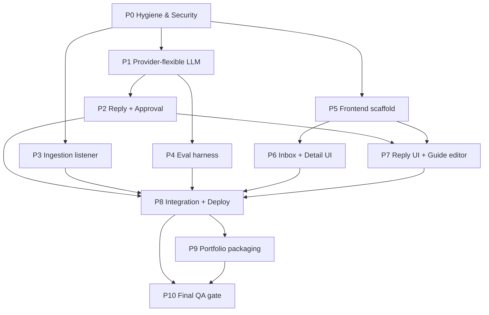

# Agent Build Plan — AI Inbox Triage (Project 1)

> **Purpose.** This is the single execution document for finishing Project 1 with autonomous agents.
> It takes the project from its current state (a complete Phase‑1 backend, empty frontend) to a
> deployed, portfolio‑ready full‑stack product. Every phase is a self‑contained work order with a
> copy‑paste agent **prompt**, an assigned **model**, the **reasoning** for that model, dependencies,
> and a **definition of done**.

> **Naming note.** The portfolio brief calls this "AI Inbox & CRM Automation". The code and vision
> docs that were actually built describe an **AI Inbox Triage** system for a support inbox
> (classify → prioritise → suggest action → route → human‑approved reply). This document completes the
> **built** system and treats the sales‑CRM framing as a superseded narrative (see
> [Findings & Decisions](#findings--decisions)).

---

## 1. How to use this document

1. Read [Shared Engineering Standards](#4-shared-engineering-standards) once — every phase prompt
   inherits these rules, so they are not repeated in each prompt.
2. Execute phases in dependency order (see [Dependency graph](#6-orchestration--dependency-graph)).
   Independent phases can run **in parallel** as separate agents/worktrees.
3. For each phase: spawn an agent **with the assigned model**, paste the **prompt**, let it work on
   its **own branch**, then run the **definition of done** checks before merging.
4. High‑stakes phases (2, 4, 8) get a **review gate** from a different model before merge.
5. Phase 10 is a final independent QA pass over the whole product.

Each phase prompt is written to be pasted into a fresh agent that has **no prior context**, so each
one starts with a "Read first" list of files.

---

## 2. Current state assessment

### Done — Backend Phase 1 (triage + extraction + persistence)

| Area | Status | Where |
|---|---|---|
| Email ingestion (`POST /messages`) + mock ingest script | Done | `backend/routers/messages.py`, `backend/scripts/mock_ingest.py` |
| Preprocessing (normalise + signal extraction) | Done | `backend/services/preprocessor.py` |
| JSON‑configurable guide + editable API (`GET/PUT /guide`) | Done | `backend/services/guide.py`, `backend/routers/guide.py`, `backend/data/guide_config.json` |
| Ollama LLM client (JSON mode, timeouts, clear 503) | Done | `backend/services/llm_client.py` |
| Classifier pipeline (parse → validate → retry → destination) | Done | `backend/services/classifier.py`, `backend/models/classifier_models.py` |
| SQLite persistence (messages, analyses, attempts, guide, audit) | Done | `backend/db/` |
| REST API (`/health`, `/classify`, `/messages*`, `/guide`, audit) | Done | `backend/routers/` |
| Unit + API smoke tests | Done | `backend/tests/` |
| Backend README + `.env.example` | Done | `backend/` |
| Labeled eval dataset (5 examples) | Done | `backend/data/phase_1_email_triage_examples.json` |

### Remaining — what "complete" requires

| Gap | Phase |
|---|---|
| Repo hygiene: leaked secret, `.gitignore`, dedicated git repo | Phase 0 |
| Provider‑flexible LLM (OpenAI/Anthropic branch + test mock) | Phase 1 |
| Reply drafting + human approval + mock send | Phase 2 |
| Ingestion listener (mock poller / IMAP stub) + dedup | Phase 3 |
| Runnable evaluation harness + expanded dataset + safety tests | Phase 4 |
| Frontend scaffold + design system + typed API client | Phase 5 |
| Frontend: inbox + message detail + triage views | Phase 6 |
| Frontend: reply approval + guide editor + audit timeline | Phase 7 |
| Containerisation, CI, deployment, E2E happy path | Phase 8 |
| Root README, architecture diagram, screenshots, case study | Phase 9 |
| Final QA / architecture review gate | Phase 10 |

---

## 3. Findings & Decisions

1. **SECURITY — leaked credential (act before anything else).** `docs/cook` contains a Cursor API key
   (`crsr_…`). Phase 0 deletes it, but an agent **cannot rotate** it: a human must revoke/rotate the
   key in the Cursor dashboard. Treat the existing key as compromised.
2. **Git root is wrong for an agent workflow.** The repo resolves to `C:/Users/Justas` (home directory),
   not the project. Branch/PR/worktree orchestration needs a dedicated repo. **Decision:** Phase 0 runs
   `git init` inside the project and adds a `.gitignore` before any other agent touches code.
3. **Domain divergence — triage vs CRM.** `docs/plan.md` and `.cursor/plans/portfolio_projects.md`
   describe a sales lead/CRM app; the built backend and `docs/how this project will work` describe a
   **support inbox triage** system. **Decision:** complete the built triage system (it is coherent and
   ~one backend phase + a frontend away from done) and reframe the portfolio case study around support
   triage. If the user actually wants the sales‑CRM product, that is a different project and this plan
   should be revisited.
4. **Provider promise unmet.** Plans advertise "provider‑flexible (OpenAI or Claude)" but
   `llm_client.py` only implements Ollama. **Decision:** Phase 1 makes the abstraction real so the dev
   story (Ollama, zero cost) and the prod story (cloud API) both hold.
5. **Eval exists but is not runnable.** The dataset is present; there is no script that measures
   accuracy or enforces safety invariants (e.g. "urgent must never be classified ignore").
   **Decision:** Phase 4 builds a real harness; this is the project's "trust" story.
6. **Scope discipline.** Keep the AI a *suggestion* layer. No real SMTP, no live mailbox, no auto‑escalation
   in the MVP. Replies and sends are **mock + audited** and require human approval.

---

## 4. Shared Engineering Standards

Every agent must follow these. Phase prompts reference this section instead of repeating it.

**Architecture & safety**
- The AI **suggests**; humans **approve** anything that leaves the system (replies, sends, escalation).
- Never trust model output for control flow. `destination`/routing is computed in Python, never read
  from the model. Validate all LLM JSON against Pydantic before persistence.
- Invalid/failed AI output must set `needs_review` and be logged in `analysis_attempts` — never silently
  overwrite good data.
- Respect existing module boundaries: `models/` (domain + LLM contract), `schemas/` (HTTP I/O),
  `services/` (logic), `routers/` (endpoints), `db/` (persistence). Do not collapse them.

**Backend (Python / FastAPI)**
- Python 3.11+, full type hints, Pydantic v2.
- Keep functions small and pure where possible; side effects live in `services`/`db`.
- HTTP error contract: `503` when the model provider is unreachable, `422` when analysis fails
  validation after retries, `404` for missing entities, `400` for bad input.
- Add or update tests for any risky logic you touch. Tests must pass **without a live LLM** (mock it).

**Frontend (React / TypeScript)**
- Vite + React + TypeScript + Tailwind CSS. Function components + hooks.
- One typed API client module; no `fetch` scattered across components. Types mirror backend schemas.
- Every data view handles **loading / empty / error** states explicitly. Surface backend `503`/`422`
  as friendly, actionable messages.
- Make human approval visually central; show AI confidence/reasoning without overwhelming the user.
- Accessible components (labels, focus states, keyboard nav for primary actions).

**Hygiene**
- No secrets in code or git. Use `.env` (gitignored) + `.env.example`.
- No narrating comments. Comment only non‑obvious intent/trade‑offs.
- Conventional commits (`feat:`, `fix:`, `test:`, `docs:`, `chore:`). One phase = one branch = one PR.
- Update the relevant README when behaviour or setup changes.
- Run formatters/linters and the test suite before declaring done.

---

## 5. Model roster & load‑balancing strategy

The goal is to put the **strongest, most expensive** models only on genuinely hard or high‑stakes work,
and the **fast, cheap** models on bulk/boilerplate — so cost and quality are both optimised.

| Tier | Model | Strengths | Cost/Speed | Use for |
|---|---|---|---|---|
| Reasoning‑max | `claude-opus-4-8-thinking-max` | Deepest reasoning, safety judgment | Slowest / dearest | AI reply+approval pipeline, final QA/architecture review |
| Reasoning‑high | `gpt-5.5-extra-high` | Strong reasoning, cross‑cutting correctness, good 2nd opinion | Expensive | Eval harness design, integration & deployment, review gates |
| Code‑heavy | `gpt-5.3-codex` | High‑throughput multi‑file code generation | Mid‑high | Large frontend feature builds |
| Balanced | `claude-4.6-sonnet-medium-thinking` | Reliable reasoning + coding workhorse | Mid | Provider abstraction, stateful approval UI |
| Standard | `claude-4-sonnet` | Solid, predictable implementation | Mid‑low | Straightforward features, wiring, scaffolding |
| Fast/cheap | `composer-2.5-fast` | Fast, inexpensive | Fastest / cheapest | Hygiene, config, docs, repetitive edits |

**Phase → model map**

| Phase | Difficulty | Model | One‑line reason |
|---|---|---|---|
| 0 Hygiene & security | Low | `composer-2.5-fast` | Mechanical deletes/config; no deep reasoning |
| 1 Provider‑flexible LLM | Medium | `claude-4.6-sonnet-medium-thinking` | Clean interface design, bounded scope |
| 2 Reply + approval + mock send | High | `claude-opus-4-8-thinking-max` | Safety‑critical (external comms), subtle state machine |
| 3 Ingestion listener + dedup | Med‑low | `claude-4-sonnet` | Reuses ingest pipeline; idempotency is standard |
| 4 Evaluation harness + risk tests | High | `gpt-5.5-extra-high` | Metric/invariant design is subtle; diversify from Claude line |
| 5 Frontend scaffold + API client | Med‑low | `claude-4-sonnet` | Foundational but standard setup |
| 6 Inbox + message detail UI | Medium | `gpt-5.3-codex` | Largest code volume; many components |
| 7 Reply approval + guide editor UI | Medium | `claude-4.6-sonnet-medium-thinking` | Stateful approval UX, depends on Phase 2 |
| 8 Integration, CI, deployment | High | `gpt-5.5-extra-high` | Cross‑cutting; Docker + multi‑service + Ollama |
| 9 Portfolio packaging & docs | Low | `composer-2.5-fast` | Writing/assembly from existing material |
| 10 Final QA / review gate | High | `claude-opus-4-8-thinking-max` | Independent deep review of the whole system |

**Review gates** (a *different* model reviews before merge): Phase 2 reviewed by `gpt-5.5-extra-high`;
Phase 4 reviewed by `claude-opus-4-8-thinking-max`; Phase 8 reviewed by `claude-opus-4-8-thinking-max`.

---

## 6. Orchestration & dependency graph

- **One phase → one branch → one PR.** Branch names: `phase-0-hygiene`, `phase-1-provider`, etc.
- Backend track and frontend track run **in parallel** after Phase 0.
- Frontend Phase 7 must wait for backend Phase 2 (it consumes reply endpoints).
- Phase 8 integrates everything; Phases 9–10 close out.



**Suggested parallel waves**
- Wave 1: P0
- Wave 2 (parallel): P1, P3, P5
- Wave 3 (parallel): P2, P4 (after P1); P6 (after P5)
- Wave 4: P7 (after P2 + P5)
- Wave 5: P8 → P9 → P10

---

## 7. Phases

Each phase uses this contract: **Meta → Goal → Scope → Prompt → Definition of Done.**
Paste the **Prompt** verbatim into an agent running the assigned **Model**.

---

### Phase 0 — Repo hygiene & security

- **Model:** `composer-2.5-fast` · **Difficulty:** Low · **Depends on:** none · **Branch:** `phase-0-hygiene`

**Goal.** Make the repository safe and ready for an agent branch/PR workflow before any feature work.

**Scope.** Remove the committed secret; create a dedicated git repo in the project; add `.gitignore`
and a root README skeleton; add an `AGENTS.md` capturing the shared standards so future agents inherit them.

**Prompt.**
```text
You are a setup agent. Work only inside the project folder
"AI Inbox & CRM Automation". Make a branch "phase-0-hygiene".

Read first: docs/agent_build_plan.md (sections 3 and 4), backend/.env.example.

Tasks:
1. Delete the file docs/cook — it contains a leaked Cursor API key. After deleting,
   print a clear WARNING in your final message telling the human to revoke/rotate that
   key in the Cursor dashboard (you cannot rotate it yourself).
2. If the project has no its own git repository (git rev-parse --show-toplevel resolves
   outside this folder), run `git init` in the project root so this project is a
   standalone repo. Do not touch any git repo above the project folder.
3. Create a root .gitignore covering: __pycache__/, *.pyc, .pytest_cache/, .venv/,
   venv/, *.db, backend/data/*.db, .env, node_modules/, dist/, build/, .DS_Store,
   frontend/.env, *.local.
4. Verify backend/.env is NOT tracked by git; if tracked, untrack it (keep the file on disk).
   Confirm backend/.env.example remains tracked.
5. Create a minimal root README.md with the project name, one-paragraph description
   (support inbox triage with human-approved replies), and a "See docs/agent_build_plan.md"
   pointer. Keep it short; Phase 9 expands it.
6. Create AGENTS.md at the repo root containing the "Shared Engineering Standards"
   from docs/agent_build_plan.md section 4 (copy them) so every future agent follows them.

Constraints: do not modify backend application code. Do not commit any secret.
Definition of done: docs/cook gone; .gitignore + AGENTS.md + README.md present;
backend/.env untracked; `git status` clean except intended new files; final message
includes the key-rotation warning.
```

**Definition of Done.** Secret removed; standalone git repo; `.gitignore`, `AGENTS.md`, root `README.md`
present; `backend/.env` untracked; rotation warning surfaced.

---

### Phase 1 — Provider‑flexible LLM layer

- **Model:** `claude-4.6-sonnet-medium-thinking` · **Difficulty:** Medium · **Depends on:** P0 · **Branch:** `phase-1-provider`

**Goal.** Make the "OpenAI or Claude or Ollama behind one interface" promise real, and make AI‑dependent
tests runnable without a live model.

**Scope.** Add OpenAI and Anthropic branches to `call_llm`; add a deterministic `mock`/`fake` provider for
tests; keep Ollama the dev default; document env vars; add provider‑selection tests.

**Prompt.**
```text
You are a backend agent. Branch "phase-1-provider". Python/FastAPI project in backend/.

Read first: backend/services/llm_client.py, backend/config.py, backend/.env.example,
backend/services/classifier.py, docs/agent_build_plan.md sections 4 and 3 (item 4).

Goal: make the LLM client provider-flexible behind the existing call_llm(system_prompt,
user_prompt) -> str interface, without changing the classifier pipeline contract.

Tasks:
1. In backend/services/llm_client.py add provider branches selected by settings.llm_provider:
   - "ollama" (existing, keep as default)
   - "openai": call the OpenAI Chat Completions API via httpx using settings.llm_api_key and
     settings.llm_model; request JSON output; map connectivity errors to OllamaUnavailableError's
     sibling — introduce a generic ProviderUnavailableError and have OllamaUnavailableError
     subclass it so existing 503 handling still works. Map other API errors to LLMError.
   - "anthropic": same shape via the Anthropic Messages API.
   - "mock": return a deterministic, valid EmailAnalysis-shaped JSON string derived from simple
     keyword rules on the prompt (used by tests and offline demos). No network.
2. Keep all network calls behind httpx with the configured timeout. Never hardcode keys.
3. Update backend/config.py / .env.example with any new vars (e.g. OPENAI_BASE_URL) and document
   that LLM_PROVIDER=mock requires no key and no network.
4. Add backend/tests/test_llm_client.py: unit tests using monkeypatch for the openai/anthropic
   branches (assert request shape + error mapping) and a real test for the "mock" provider.
   No live network in tests.
5. Update backend/README.md "Configuration" with the new providers.

Constraints: do not change the classifier's parse/validate/retry logic or the API routes.
Existing tests must still pass. Follow Shared Engineering Standards (AGENTS.md).
Definition of done: `pytest` green offline; switching LLM_PROVIDER between ollama/openai/
anthropic/mock changes behaviour with no other code changes; errors map to 503 vs 422 correctly.
```

**Definition of Done.** Four providers selectable by env var; `mock` provider enables offline tests/demo;
all tests pass without network; error→status mapping preserved.

---

### Phase 2 — Reply drafting + human approval + mock send

- **Model:** `claude-opus-4-8-thinking-max` · **Difficulty:** High · **Depends on:** P1 · **Branch:** `phase-2-replies`
- **Review gate:** `gpt-5.5-extra-high` before merge.

**Goal.** Add the highest‑value, highest‑risk feature: AI‑drafted replies that a human edits/approves/sends
(mock), with a strict no‑send‑without‑approval invariant and full audit.

**Scope.** New `draft_replies` table; generate draft via a separate validated LLM call; edit/approve/send
(mock) endpoints with a status state machine; audit at every transition; tests for the safety invariant.

**Prompt.**
```text
You are a senior backend agent. Branch "phase-2-replies". Treat this as safety-critical:
AI drafts customer-facing text, but nothing leaves the system without explicit human approval.

Read first: backend/services/classifier.py, backend/models/classifier_models.py,
backend/db/schema.sql, backend/db/repository.py, backend/routers/messages.py,
backend/schemas/messages.py, backend/services/guide.py, docs/agent_build_plan.md sections 3,4,
and docs/how this project will work.

Design then implement (explain the state machine in the PR description):

1. Data model: add a draft_replies concept. A reply has states:
   draft -> edited -> approved -> sent  (and can be regenerated -> new draft).
   Add a draft_replies table in schema.sql (id, message_id FK, analysis_id FK nullable,
   generated_text, edited_text nullable, status, tone default "professional",
   created_at, updated_at, approved_by nullable, sent_at nullable). Add indexes on message_id, status.
2. Generation: add services/reply.py with generate_reply(message, analysis) that makes a SEPARATE
   LLM call (use llm_client + a versioned prompt built from the guide) returning a short reply.
   Validate output (length, non-empty) before persisting. Reuse the retry/attempt-logging pattern
   from classifier.py; on failure set needs_review and log an attempt — never persist garbage.
3. Endpoints (extend routers/messages.py or a new routers/replies.py):
   - POST /messages/{id}/draft-reply  -> generate + store a draft (requires an existing analysis)
   - GET  /messages/{id}/reply        -> latest reply for the message
   - PATCH /messages/{id}/reply       -> human edits edited_text (status -> edited)
   - POST /messages/{id}/reply/approve-> status -> approved (records approved_by)
   - POST /messages/{id}/reply/send   -> MOCK send only: allowed ONLY if status == approved;
     otherwise 409 Conflict. On success status -> sent, sets sent_at, writes audit "reply_sent"
     with actor. Do NOT integrate real SMTP.
4. Audit: write audit_events for draft_created, reply_edited, reply_approved, reply_sent.
5. Schemas: add request/response models in schemas/. Keep HTTP I/O in schemas/, domain in models/.
6. Tests (no live LLM — use LLM_PROVIDER=mock or monkeypatch):
   - sending without approval returns 409 (the core safety invariant)
   - approve then send transitions to sent and writes the audit event
   - editing updates edited_text and status
   - generation failure sets needs_review and logs an attempt

Constraints: follow Shared Engineering Standards (AGENTS.md). Do not weaken classifier safety.
Keep the second LLM call separate from triage so each is testable. Document Phase 2 endpoints in
backend/README.md.
Definition of done: full draft->edit->approve->send(mock) flow works end to end with audit at each
step; the no-send-without-approval test passes; `pytest` green offline.
```

**Definition of Done.** Reply lifecycle implemented with a strict approval gate (409 on premature send),
audited transitions, validated generation with retry, and tests proving the safety invariant — all offline.

---

### Phase 3 — Ingestion listener + deduplication

- **Model:** `claude-4-sonnet` · **Difficulty:** Med‑low · **Depends on:** P0 · **Branch:** `phase-3-ingest`

**Goal.** Prove the "emails arrive at a group address" story without OAuth risk, by adding a pluggable
ingestion source that funnels into the *same* ingest pipeline, idempotently.

**Scope.** A mock folder/file poller (drop `.json`/`.eml` files → ingest), dedup by source message id,
and an IMAP stub interface documented for later. No live mailbox in MVP.

**Prompt.**
```text
You are a backend agent. Branch "phase-3-ingest". Reuse the existing ingest path; do not fork it.

Read first: backend/scripts/mock_ingest.py, backend/routers/messages.py, backend/db/repository.py,
backend/db/schema.sql, backend/models/classifier_models.py, docs/agent_build_plan.md sections 4 and 3.

Tasks:
1. Add an idempotency key: extend messages with a nullable source_message_id (unique when present).
   Update schema.sql + repository.create_message to accept it and skip (return existing id) on
   duplicate instead of inserting twice. Add a unique index that ignores NULLs.
2. Add services/ingest.py with ingest_message(email, source, source_message_id=None) that all
   transports call. The existing POST /messages and mock_ingest.py must route through it.
3. Add a mock folder poller: backend/scripts/folder_listener.py that watches backend/data/inbox_drop/
   for *.json (and *.eml if simple) files, parses each into EmailInput, calls ingest_message with
   source="folder" and a source_message_id derived from filename/Message-ID, then moves the file to
   a processed/ subfolder. Make it a one-shot run by default with an optional --watch loop.
4. Document an EmailSource protocol (Python Protocol/ABC) in services/ingest.py with a docstring
   showing how a future IMAP listener would implement the same interface (stub only, no live IMAP).
5. Tests: ingesting the same source_message_id twice yields one message; folder listener parses a
   sample dropped file into a message.

Constraints: no OAuth, no live IMAP, no network mailbox in this phase. Follow AGENTS.md.
Definition of done: duplicate ingestion is idempotent; folder drop -> message in DB via the shared
pipeline; `pytest` green offline; README notes how to use the folder listener.
```

**Definition of Done.** Single shared `ingest_message` path; idempotent dedup by `source_message_id`;
working mock folder listener; documented source interface; tests pass.

---

### Phase 4 — Evaluation harness + risk tests

- **Model:** `gpt-5.5-extra-high` · **Difficulty:** High · **Depends on:** P1 · **Branch:** `phase-4-eval`
- **Review gate:** `claude-opus-4-8-thinking-max` before merge.

**Goal.** Build the project's "trust" story: measure classifier quality and enforce safety invariants
automatically.

**Scope.** A runnable eval script producing per‑field accuracy + a confusion matrix; expand the dataset
to ~15–20 labeled edge cases; encode safety invariants as tests.

**Prompt.**
```text
You are an evaluation/QA engineer agent. Branch "phase-4-eval".

Read first: backend/data/phase_1_email_triage_examples.json, backend/services/classifier.py,
backend/models/classifier_models.py, docs/phase_1_analysis_decisions.md, docs/agent_build_plan.md
sections 3 (item 5) and 4.

Tasks:
1. Build backend/eval/run_eval.py that:
   - loads the labeled dataset, runs the classifier on each example (default LLM_PROVIDER from env;
     support a --provider flag; the "mock" provider must work offline for CI),
   - computes accuracy per field (category, priority, suggested_action) and overall exact-match,
   - prints a confusion matrix for category and for priority,
   - writes a JSON/markdown report to backend/eval/reports/ with a timestamp,
   - exits non-zero if accuracy falls below configurable thresholds (so it can gate CI).
2. Expand the dataset to 15-20 examples covering edge cases: ambiguous human-vs-machine, multiple
   order IDs, partial health-check failures, spam that looks urgent, events with deadlines, requests
   to run commands (must be ask_human). Keep the existing schema and label values.
3. Encode SAFETY INVARIANTS as pytest tests in backend/tests/test_eval_invariants.py using the
   "mock"/deterministic provider so they run offline:
   - an email containing failure/outage/trading-impact signals is NEVER priority "ignore",
   - an all-green health check is NEVER "urgent_action",
   - a request to run admin commands maps to suggested_action "ask_human".
4. Document how to run the eval in backend/README.md (a "Evaluation" section).

Constraints: the eval must be reproducible offline via the mock provider; live-model runs are
optional and flag-gated. Follow AGENTS.md. Do not change label schemas.
Definition of done: `python backend/eval/run_eval.py --provider mock` produces a report and a
pass/fail exit code; dataset >=15 examples; invariant tests pass in `pytest` offline.
```

**Definition of Done.** Reproducible offline eval with metrics + confusion matrices + thresholded exit
code; ≥15 labeled examples; safety‑invariant tests passing.

---

### Phase 5 — Frontend scaffold + design system + typed API client

- **Model:** `claude-4-sonnet` · **Difficulty:** Med‑low · **Depends on:** P0 · **Branch:** `phase-5-fe-scaffold`

**Goal.** Stand up the React app shell, design tokens, routing, and a single typed API client mirroring
the backend — the foundation every UI phase builds on.

**Scope.** Vite + React + TS + Tailwind in `frontend/`; app shell/nav; typed API client + types matching
backend schemas; shared loading/empty/error primitives; env config for API base URL.

**Prompt.**
```text
You are a frontend platform agent. Branch "phase-5-fe-scaffold". The frontend/ folder is empty.

Read first: backend/schemas/messages.py, backend/schemas/classifier.py,
backend/models/classifier_models.py, backend/routers/ (all), docs/agent_build_plan.md section 4,
docs/how this project will work.

Tasks:
1. Scaffold a Vite + React + TypeScript app in frontend/ with Tailwind CSS configured.
   Add scripts: dev, build, preview, lint, typecheck. Use a clean folder layout:
   src/api, src/components, src/pages, src/types, src/lib.
2. Create src/types matching backend response shapes (MessageListItem, MessageDetail, Analysis,
   ExtractedFields, GuideConfig, AuditEvent, Reply). Keep them in sync with backend schemas.
3. Create src/api/client.ts: a single typed API client wrapping fetch with a configurable base URL
   (VITE_API_BASE_URL, default http://127.0.0.1:8000), JSON handling, and typed methods for the
   currently existing endpoints (health, list/get/create/analyze messages, get/put guide, message audit).
   Normalise backend errors (503/422/404/400) into a typed AppError the UI can render.
4. Build an app shell: top bar (app name + Ollama/provider status pill via /health), left nav
   (Inbox, Guide), and a routed content area (react-router). Add placeholder pages for Inbox and Guide.
5. Add reusable primitives in src/components: Spinner/Loading, EmptyState, ErrorState, Badge,
   Button, Card — styled with Tailwind, accessible.
6. Add frontend/.env.example (VITE_API_BASE_URL) and a short frontend/README.md (setup + run).

Constraints: TypeScript strict mode on; no `any` in the API client; handle loading/empty/error
everywhere data is fetched. Follow AGENTS.md frontend rules.
Definition of done: `npm run dev` serves the shell; `npm run build` and `npm run typecheck` pass;
the health pill reflects backend reachability; nav + placeholder pages render.
```

**Definition of Done.** Running Vite app with typed API client, routing, shell, reusable state
primitives; build + typecheck clean.

---

### Phase 6 — Inbox + message detail + triage views

- **Model:** `gpt-5.3-codex` · **Difficulty:** Medium · **Depends on:** P5 · **Branch:** `phase-6-fe-inbox`

**Goal.** The core review experience: see triaged messages and drill into one to view the original email,
the AI analysis, extracted fields, reasoning, and audit.

**Scope.** Inbox list grouped/filterable by destination & category with priority + needs_review badges;
message detail page with original email, analysis panel, extracted fields, reasoning, "Analyze" action,
and audit timeline.

**Prompt.**
```text
You are a frontend feature agent. Branch "phase-6-fe-inbox". Build on the Phase 5 scaffold.

Read first: frontend/src/api/client.ts, frontend/src/types/*, frontend/src/components/*,
backend/routers/messages.py, backend/schemas/messages.py, docs/agent_build_plan.md section 4.

Tasks:
1. Inbox page (src/pages/InboxPage):
   - fetch GET /messages; show a list/table with subject, sender, category, priority, destination,
     needs_review flag, created_at.
   - colour-coded Badge components for priority (urgent/non-urgent/ignore) and category.
   - filter controls: by destination and by category; a "needs review" toggle.
   - clicking a row navigates to the detail page. Handle loading/empty/error states.
2. Message detail page (src/pages/MessagePage, route /messages/:id):
   - fetch GET /messages/{id}; show the original email (subject/body/sender) in one panel.
   - Analysis panel: category, priority, suggested_action, destination, reason, model_name,
     needs_review. Show extracted_fields (order_ids, instance_names, error_summary, keywords)
     clearly (chips/lists).
   - "Analyze" / "Re-analyze" button -> POST /messages/{id}/analyze; show progress; on 503 show a
     "model unavailable" message; on 422 show "analysis failed, needs review". Refresh on success.
   - Audit timeline: fetch GET /messages/{id}/audit and render chronologically with action, actor, time.
3. Wire navigation from the app shell. Keep all API calls in the typed client (extend it if needed).

Constraints: TypeScript strict; reuse Phase 5 primitives; explicit loading/empty/error; no `any`.
Follow AGENTS.md. Do not add backend endpoints — only consume existing ones.
Definition of done: from the inbox a reviewer can open a message, run analysis, and see the result,
extracted fields, and audit trail; filters work; `npm run build` + typecheck pass.
```

**Definition of Done.** Functional inbox with filters/badges and a complete message detail view
(original + analysis + extracted fields + analyze action + audit), all states handled.

---

### Phase 7 — Reply approval + guide editor + audit polish

- **Model:** `claude-4.6-sonnet-medium-thinking` · **Difficulty:** Medium · **Depends on:** P2, P5 · **Branch:** `phase-7-fe-reply`

**Goal.** Close the human‑in‑the‑loop loop in the UI: review/edit/approve/send (mock) the AI reply, and
let users edit the triage guide in a textbox and save it.

**Scope.** Reply editor with the draft→edit→approve→send state surfaced and gated; guide editor (JSON in a
textbox per the user's preference) with validation + save; reflect reply events in the audit timeline.

**Prompt.**
```text
You are a frontend feature agent. Branch "phase-7-fe-reply". Build on Phases 5 and 6.
This UI enforces human approval — make the approval step visually unmistakable.

Read first: frontend/src/api/client.ts, frontend/src/pages/MessagePage*, backend/routers
(messages/replies + guide), backend/schemas/messages.py, docs/agent_build_plan.md sections 3,4.

Tasks:
1. Reply panel on the message detail page:
   - "Generate reply" -> POST /messages/{id}/draft-reply (requires an analysis; disable otherwise).
   - Show the draft in an editable textarea; PATCH /messages/{id}/reply to save edits (status -> edited).
   - "Approve" -> POST .../reply/approve; visually mark approved.
   - "Send" -> POST .../reply/send; ENABLED ONLY when status == approved. If the backend returns 409,
     show "You must approve before sending." Show sent state + sent_at on success.
   - Surface 503/422 from generation as friendly messages. Handle loading on every action.
2. Guide editor page (src/pages/GuidePage):
   - GET /guide -> render the config JSON in a large textarea (the user prefers a textbox).
   - Validate JSON client-side before enabling Save; on Save PUT /guide; show success/error.
   - Show updated_at/updated_by if present. Warn that changes affect future analyses.
3. Audit: ensure reply_created/edited/approved/sent events appear in the message audit timeline.
4. Extend the typed API client with the reply + guide methods.

Constraints: the Send button must be impossible to use before Approve (disabled + backed by the 409
guard). TypeScript strict; reuse primitives; handle all states. Follow AGENTS.md.
Definition of done: a reviewer can generate -> edit -> approve -> send(mock) a reply with the gate
enforced in the UI, and can view/edit/save the guide; `npm run build` + typecheck pass.
```

**Definition of Done.** End‑to‑end reply approval flow in the UI with the approval gate visible and
enforced; working guide editor with validation; reply events in the audit timeline.

---

### Phase 8 — Integration, CI & deployment

- **Model:** `gpt-5.5-extra-high` · **Difficulty:** High · **Depends on:** P2, P3, P4, P6, P7 · **Branch:** `phase-8-deploy`
- **Review gate:** `claude-opus-4-8-thinking-max` before merge.

**Goal.** Make the whole system runnable with one command locally, gated by CI, and deployable for the
portfolio demo.

**Scope.** Dockerfiles (backend, frontend), `docker-compose` (backend + frontend + optional Ollama),
CORS/env wiring, a CI workflow (lint + typecheck + pytest + offline eval), and one Playwright happy‑path;
a deployment guide using the `mock`/cloud provider so the demo never depends on a local GPU.

**Prompt.**
```text
You are a DevOps/integration agent. Branch "phase-8-deploy". Integrate backend + frontend so the
whole product runs with one command and is deployable.

Read first: backend/ (config, main, requirements), frontend/ (package.json, vite config, api client),
backend/eval/run_eval.py, docs/agent_build_plan.md sections 3,4,6.

Tasks:
1. Backend Dockerfile (python:3.11-slim): install requirements, run uvicorn. Frontend Dockerfile
   (node build -> static serve, e.g. nginx or vite preview). Keep images small (multi-stage FE).
2. docker-compose.yml at repo root with services: backend (env from .env), frontend (VITE_API_BASE_URL
   pointing at backend), and an OPTIONAL ollama service behind a compose profile so it is opt-in.
   Default the demo to LLM_PROVIDER=mock so it runs with no GPU/keys; document switching to ollama/cloud.
3. Wire config: ensure backend CORS allows the frontend origin via env; ensure DB path persists via a
   volume; ensure frontend reads the API base URL from env at build/runtime.
4. CI: add .github/workflows/ci.yml that runs backend lint + pytest (offline) + `run_eval.py --provider
   mock` (must pass thresholds), and frontend lint + typecheck + build. Cache deps.
5. E2E: add one Playwright test that, against compose with provider=mock, ingests a sample message,
   analyzes it, generates a reply, approves, and sends (mock) — asserting the gate. Keep it minimal.
6. Write docs/deployment.md: local (docker-compose up), provider choices (mock/ollama/cloud), and a
   free/low-cost hosting recipe for backend + frontend.

Constraints: the default demo path must require no secrets and no GPU (provider=mock). Do not commit
secrets. Follow AGENTS.md.
Definition of done: `docker-compose up` brings up a working app at the documented URLs with
provider=mock; CI is green; the Playwright happy-path passes; deployment.md is complete.
```

**Definition of Done.** One‑command local run via compose (secretless default), green CI (tests + offline
eval + FE build), a passing E2E happy path, and a deployment guide.

---

### Phase 9 — Portfolio packaging & documentation

- **Model:** `composer-2.5-fast` · **Difficulty:** Low · **Depends on:** P8 · **Branch:** `phase-9-portfolio`

**Goal.** Make a reviewer understand the value in 60 seconds and give you strong interview material.

**Scope.** Expand the root README (problem, users, demo flow, architecture diagram, setup, trade‑offs);
write a case study; add screenshots/GIF placeholders; add an interview Q&A.

**Prompt.**
```text
You are a technical writer agent. Branch "phase-9-portfolio". Assemble portfolio-quality docs from
existing material — do not invent features that aren't implemented.

Read first: docs/agent_build_plan.md, docs/plan.md, docs/how this project will work,
docs/phase_1_analysis_decisions.md, backend/README.md, frontend/README.md, docs/deployment.md.

Tasks:
1. Rewrite the root README.md: one-line problem statement, target users, the demo flow (numbered),
   a Mermaid architecture diagram (frontend -> FastAPI -> SQLite + LLM provider, ingest, audit),
   quickstart (docker-compose, provider=mock), feature list, trade-offs, and a "tech stack" section.
2. Create docs/case_study.md: problem, constraints, solution, key engineering decisions (AI as a
   suggestion layer, human approval gate, validated structured output + retry, server-side routing,
   provider-flexible LLM, offline eval), trade-offs, results, and "next iteration".
3. Create docs/screenshots/ with a README listing the exact screenshots/GIFs to capture
   (inbox, message detail, reply approval, guide editor, audit) and add Markdown image placeholders
   in README/case study referencing them.
4. Create docs/interview_qa.md with answers to: why human approval; why separate Message/Analysis/Reply;
   how AI output is validated; what happens when the model is wrong/unavailable; why Ollama in dev and
   cloud in prod; how the system is evaluated; where background jobs would become necessary.
5. Ensure the README's "AI Inbox Triage" framing is consistent with the built system (see section 3
   of the build plan) and note the portfolio positioning.

Constraints: accurate to the implemented system; concise; no secrets. Follow AGENTS.md.
Definition of done: root README is portfolio-grade with an architecture diagram and quickstart;
case study + interview Q&A + screenshot guide exist; links resolve.
```

**Definition of Done.** Portfolio‑grade README with diagram + quickstart; case study; interview Q&A;
screenshot capture guide — all accurate to the build.

---

### Phase 10 — Final QA / architecture review gate

- **Model:** `claude-opus-4-8-thinking-max` · **Difficulty:** High · **Depends on:** P8 (and ideally P9) · **Branch:** `phase-10-qa`

**Goal.** An independent, deep review of the finished product against the full acceptance criteria, by a
model that did not implement it.

**Scope.** Run everything; verify safety invariants and acceptance criteria; scan for secrets/regressions;
produce a prioritised punch list and fix (or file) blockers.

**Prompt.**
```text
You are an independent staff-level reviewer. Branch "phase-10-qa". You did not build this; be skeptical.

Read first: docs/agent_build_plan.md (sections 4, 8, and "Final acceptance criteria"), then the
backend and frontend code, CI config, and docs.

Tasks:
1. Run the full suite: backend `pytest`, `python backend/eval/run_eval.py --provider mock`,
   frontend `npm run typecheck && npm run build`, and `docker-compose up` with provider=mock.
   Record what passes/fails.
2. Verify the FINAL ACCEPTANCE CRITERIA in docs/agent_build_plan.md, one by one, with evidence.
3. Re-check safety: no-send-without-approval (API 409 + UI gate), invalid AI output sets needs_review
   and never overwrites good data, destination computed server-side, no secrets in git history/files.
4. Review code quality against Shared Engineering Standards: module boundaries, typing, error states,
   test coverage of risky logic. Note any `any`, dead code, or missing loading/error states.
5. Produce docs/qa_report.md: a prioritised punch list (Blocker / Major / Minor) with file references.
   Fix Blockers and Majors directly if they are small and safe; otherwise document precise repro + fix.

Constraints: do not relax safety guarantees to make tests pass. Follow AGENTS.md.
Definition of done: qa_report.md exists; all acceptance criteria are checked with evidence;
no Blockers remain open (fixed or clearly documented with a fix plan).
```

**Definition of Done.** Evidence‑backed QA report; acceptance criteria verified; safety guarantees intact;
no open blockers.

---

## 8. Final acceptance criteria (whole project)

The project is **complete** when:

1. `docker-compose up` (provider=`mock`, no secrets/GPU) serves a working app at documented URLs.
2. A reviewer can ingest/select a message, run AI analysis, and see category/priority/suggested_action/
   destination, extracted fields, reasoning, and audit.
3. A reviewer can generate → edit → **approve** → send (mock) a reply, with sending **blocked** until
   approval (HTTP 409 + disabled UI).
4. The triage guide is viewable/editable/savable from the UI and changes future analyses.
5. Ingestion is idempotent (dedup by source id) and flows through one shared pipeline.
6. The LLM layer is provider‑flexible (ollama/openai/anthropic/mock) with no code changes to switch.
7. `run_eval.py --provider mock` reports metrics + confusion matrices and gates on thresholds; safety
   invariants pass as tests.
8. Invalid/failed AI output sets `needs_review`, logs an attempt, and never overwrites good data;
   `destination` is always computed server‑side.
9. CI is green (backend tests + offline eval + frontend build) and one E2E happy path passes.
10. Root README (with architecture diagram + quickstart), case study, interview Q&A, and deployment
    guide exist and are accurate.
11. No secrets in the repo; `.env` is gitignored; `.env.example` documents configuration.

---

## 9. Risks & mitigations

| Risk | Mitigation |
|---|---|
| Leaked API key already exposed | Phase 0 deletes it; **human must rotate** the key (agents can't) |
| Demo depends on local GPU/Ollama | `mock` provider is the default demo path (Phase 1/8) |
| AI returns invalid JSON | Validate + retry + `analysis_attempts` + `needs_review` (existing) |
| External comms sent without review | No‑send‑without‑approval invariant + 409 guard + UI gate (Phase 2/7) |
| Agents drift from conventions | `AGENTS.md` + Shared Standards referenced by every prompt |
| Cross‑phase merge conflicts | One phase = one branch = one PR; clear dependency waves |
| Frontend/backend contract drift | Single typed API client mirroring backend schemas (Phase 5) |
| Over‑spending on strong models | Load‑balancing map: opus/gpt‑5.5 only on hard/high‑stakes phases |

---

## 10. Appendix

### A. Prompt template (for any new phase)

```text
You are a [role] agent. Branch "[branch]". [one-line mission + any safety note]

Read first: [exact files], docs/agent_build_plan.md sections [n], AGENTS.md.

Tasks:
1. ...
2. ...

Constraints: follow Shared Engineering Standards (AGENTS.md). [phase-specific guardrails]
Definition of done: [observable, testable outcomes].
```

### B. Commit / PR conventions

- Conventional commits: `feat:`, `fix:`, `test:`, `docs:`, `chore:`, `refactor:`.
- PR title: `Phase N: <summary>`. PR body: what changed, how to verify, which DoD items are met.
- Do not merge a phase until its Definition of Done passes; high‑stakes phases require the review gate.

### C. Model quick reference

`composer-2.5-fast` (cheap bulk) · `claude-4-sonnet` (standard) ·
`claude-4.6-sonnet-medium-thinking` (balanced) · `gpt-5.3-codex` (code volume) ·
`gpt-5.5-extra-high` (hard reasoning/integration) · `claude-opus-4-8-thinking-max` (safety‑critical + review).
